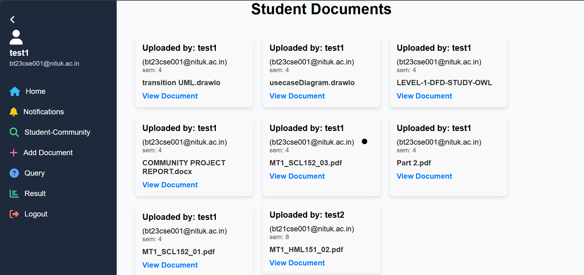
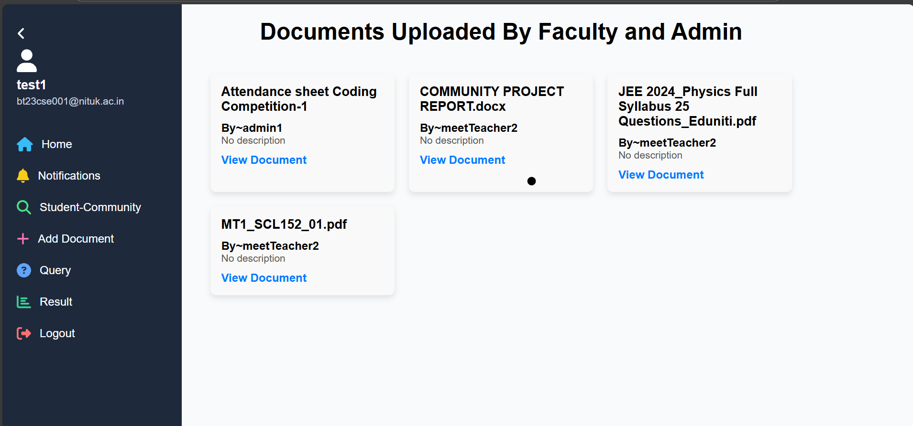
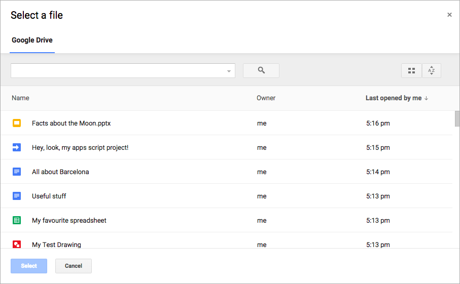

# Study Owl - Web Application

**Study Owl** is a study management platform designed primarily for university students and faculty members. It enables smooth document sharing, class management, query handling, and notification delivery, helping students stay organized throughout their academic journey.

---

## ✨ Key Features

- 📚 **Suggested and Joined Classes:** Students can view recommended classes based on their semester and manage the ones they've joined.
- 📝 **Personal Document Management:** Upload and organize personal academic documents.
- 📖 **Community Document Sharing:** Share study materials like previous year papers, notes, and books with peers.
- ❓ **Query Management:** Students can raise queries directed towards faculty or admin.
- 🔔 **Notifications Center:** Receive categorized notifications for queries, shared documents, and important updates.
- 📂 **Faculty & Admin Document Management:** View documents uploaded by faculty members or admins (such as notices, circulars, etc.).
- 👨‍🏫 **Admin Panel:** Assign/remove faculty from courses and manage class information.
- 👩‍🏫 **Faculty Dashboard:** Manage assigned classes and view student lists.

---

## 📸 Screenshots

### 1. Signup Page
> New users can register with their NITUK email and select their user type (Student, Faculty, Admin).

---

### 2. Login Page
> Login screen for all users (students, faculty, admin).

---

### 3. Student Interface - Suggested and Joined Classes
> Students can view suggested classes based on their semester, manage joined classes, and see class details.

---

### 4. Admin Interface
> Admins can manage course allocations by assigning/removing faculty and view class details.

---

### 5. Faculty Interface
> Faculty members can view their assigned classes and student details.

---

### 6. Student Personal Documents Section
> Students can manage and upload their own study documents.

---

### 7. Student Community Documents
> Access and share documents (previous year papers, notes, etc.) within the student community.

---

### 8. Raise a Query
> Raise queries to Admin or Faculty members via a structured form.

---

### 9. Notifications Section
> Receive categorized notifications for queries, document sharing, and important updates.

---

### 10. Faculty & Admin Uploaded Documents
> View class-related documents uploaded by faculty or general notices from admin.

---

## 📑 Google Picker API Integration

Study Owl uses the **Google Picker API** to allow users to upload and select documents directly from Google Drive.

> ⚠️ **Before starting the project, you must set up your Google API credentials:**

### Required Credentials:
- **Client ID**
- **Developer Key**

Both can be obtained from the [Google Cloud Console](https://console.cloud.google.com/).

### Steps to Set Up:

1. Go to [Google Cloud Console](https://console.cloud.google.com/).
2. Create a new project (or use an existing one).
3. Enable the **Google Picker API** and **Google Drive API** for your project.
4. Create OAuth 2.0 credentials:
   - **Authorized JavaScript origins** should include your local server URL (e.g., `http://localhost:3000`).
5. Copy your **Client ID** and **Developer Key**.

6. Insert them into your project:
   - In your frontend code (where you initialize the Google Picker), replace:
     - `YOUR_CLIENT_ID`
     - `YOUR_DEVELOPER_KEY`
   - with your actual credentials.

> 🔥 **Note:** Without correct credentials, the document picker functionality will not work properly.

---

## ⚙️ Tech Stack

- **Frontend:** React.js, TailwindCSS
- **Backend & Auth:** JavaScript
- **State Management:** Redux
- **Web Framework:** Node.Js and Express

---

## 📈 Future Updates

- Enhancements in document search and tagging.
- Class-based announcements and forums.
- Realtime interactions like live chatting and video conference.

---

> **Note:** All screenshots are available inside the `screenshots/` folder.

---

# 🚀 Get Started

1. Clone the repository.
2. Install dependencies using `npm install`.
4. Run locally using `npm run dev`.

**Note:** To populate courses and classes you need to hardcode the course data as per required and then seed couse and seed class. For above files I have made folders `populate course` and `populateClasses` under the `backend` folder. To seed them simply run `node backend/populate courses/seedCourse.js` and `node backend/populateClasses/seedClasses.js`.
---

